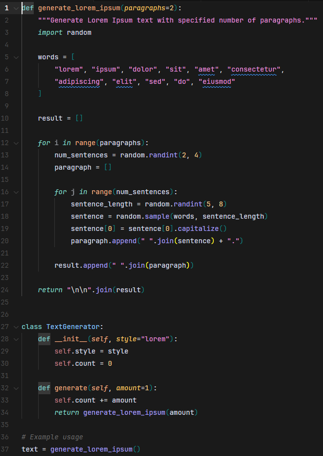
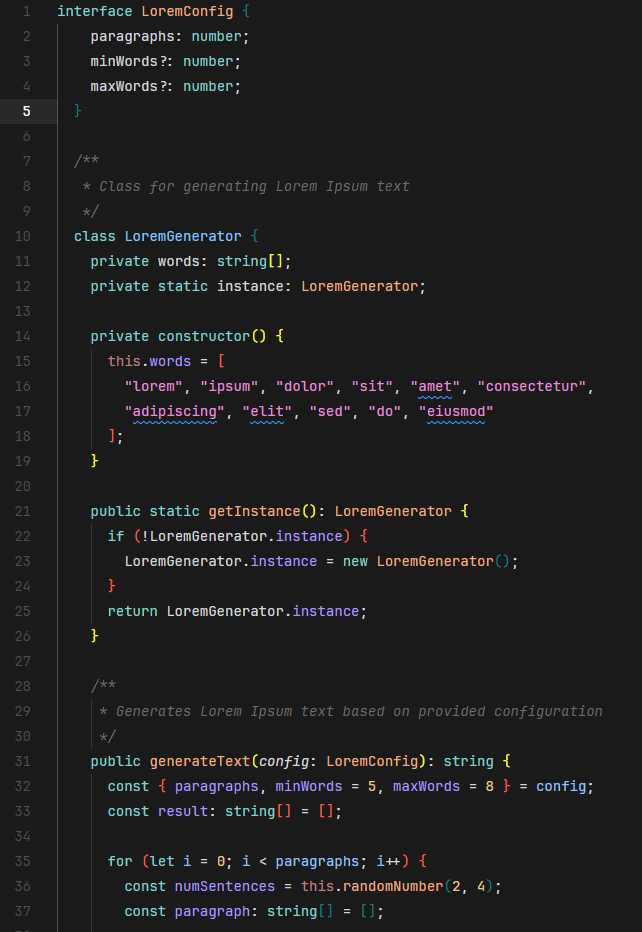
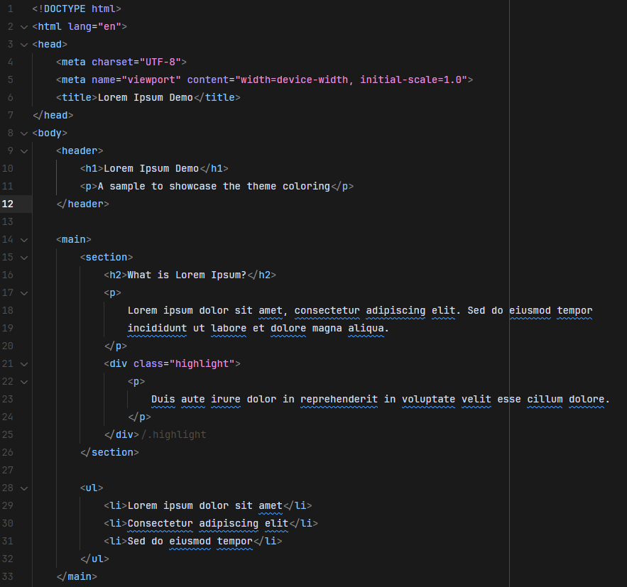
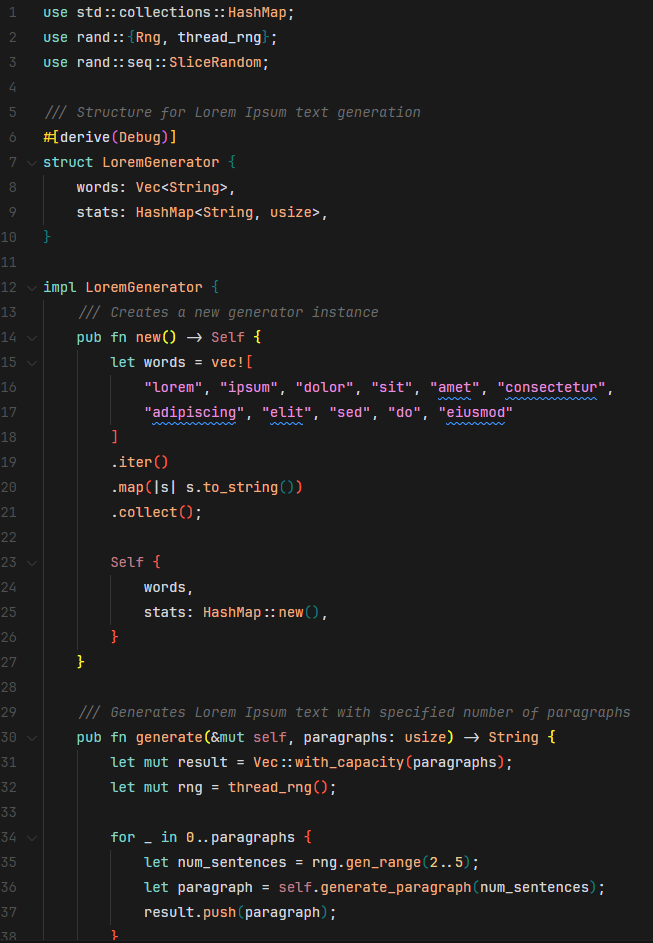
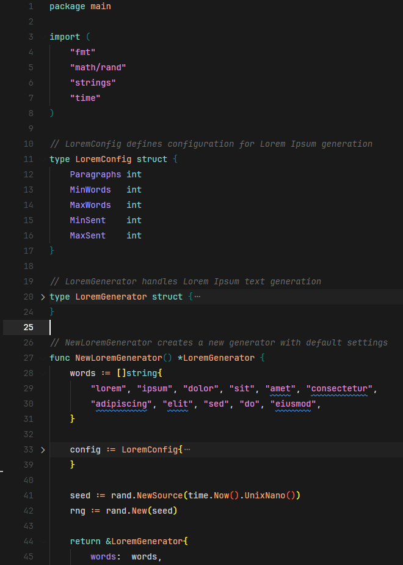

# Safe Dark Theme

A modern, eye-friendly dark theme for Visual Studio Code that enhances your coding experience with a harmonious color scheme designed for long coding sessions. Inspired by and based on the color palette of the Cursor theme color.

## Installation

1. Open VSCode
2. Go to Extensions tab (Ctrl+Shift+X)
3. Search for "Safe Dark Theme"
4. Click Install
5. Select the theme in Preferences > Color Theme

## Features

- 🌙 Carefully crafted dark color palette
- 👁️ Optimal contrast for reduced eye strain
- 🎨 Aesthetically pleasing syntax highlighting
- 🧠 Semantically meaningful color choices
- ⚡ Support for popular languages and frameworks

## Examples

Here are some examples of how your code will look with Safe Dark Theme:

### Python

### TypeScript

### HTML

### Rust

### Go

## Contributing

Contributions are welcome! Feel free to open issues or pull requests on the repository:

[https://github.com/brenoLucasN/safe-dark-theme.git](https://github.com/brenoLucasN/safe-dark-theme.git)

## License

MIT